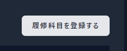

## 環境構築手順

**WSL2上での環境構築を想定しています。また、Sailを利用するためDockerのインストールも必要です。<br>WSL2とDockerのインストール手順については省略します。**

**リポジトリのクローン**<br>
以下のコマンドで本リポジトリをクローンします。<br>
`git clone https://github.com/Not-Applicable-NA/breeze`<br>
カレントディレクトリを**breeze**に変更します。<br>
`cd breeze`<br>

**Composerのパッケージのインストール**<br>
クローン直後は、vendorフォルダが存在しませんので、以下のコマンドでComposerのパッケージのインストールを行います。<br>
```
docker run --rm \　
    -u "$(id -u):$(id -g)" \　
    -v $(pwd):/var/www/html \　
    -w /var/www/html \　
    laravelsail/php82-composer:latest \　
    composer install --ignore-platform-reqs
```

**.envファイルの作成**<br>
以下のコマンドで.env.exampleをコピーして、.envファイルを作成します。<br>
`cp .env.example .env`<br>
コンテナのMySQLに接続するため、DB_HOSTを次のように変更します。
```
DB_HOST=127.0.0.1
↓
DB_HOST=mysql
```
`DB_USERNAME=`、および`DB_PASSWORD=`については、`breeze.zip`の`env.txt`からコピーしてください。<br>

**Googleカレンダーの設定**<br>
本アプリはGoogleカレンダーAPIを利用します。<br>
まず、APIが利用するカレンダーを作成します。<br>
[Googleカレンダー](https://calendar.google.com/)へアクセスし、新しいカレンダーを作成してください。名前は適当でかまいません。<br>
<br>
次に、作成したカレンダーの設定を開きます。<br>
マイカレンダーから先ほど作成したカレンダーを選択し、「設定と共有」を開いてください。<br>
<br>
設定を開いたら、「予定のアクセス制限」から、「一般公開して誰でも利用できるようにする」にチェックをいれてください。<br>
<br>
次に、「カレンダーの統合」から、カレンダーIDをコピーして、`.env`の`GOOGLE_CALENDAR_ID=`に貼り付けてください。<br>


**OAuth認証情報とAPIキー設定**<br>
本アプリの利用するGoogleカレンダーAPIでは、OAuth認証とAPIキーの両方が必要です。<br>
まず、`breeze.zip`の`google-calendar`ディレクトリを`storage/app/`内にコピーしてください。<br>
次に、`google-calendar`ディレクトリ内にある`oauth-credentials.json`を開き、`client_id`と`client_secret`をコピーし、`.env`の`GOOGLE_CLIENT_ID=`、および`GOOGLE_CLIENT_SECRET=`に貼り付けてください。<br>
次に、`breeze.zip`の`env.txt`に記載されている`GOOGLE_CALENDAR_API_KEY=`を、`.env`の`GOOGLE_CALENDAR_API_KEY=`にコピーしてください。

**APP_KEYの生成**<br>
Sailをバッググランドで起動します。<br>
`./vendor/bin/sail up -d`<br>
以下のコマンドでAPP_KEYを生成します。<br>
`sail artisan key:generate`<br>

**テーブルの作成**<br>
以下のコマンドでテーブルを作成します。<br>
`sail artisan migrate`<br>
`Nothing to migrate`と返された場合、すでにマイグレーション済みとなっていますが、念のため、`sail artisan migrate:refresh`で作成し直してください。<br>
作成されたテーブルに学部、学科、クラス、学期データを挿入するため、シーディングを行います。<br>
`sail artisan db:seed`<br>

**npmパッケージのインストール**<br>
以下のコマンドでnpmパッケージをインストールします。<br>
`sail npm install`<br>

**viteの起動**<br>
以下のコマンドでviteを起動します。<br>
`sail npm run dev`<br>

**Localhostへアクセス**<br>
[Localhost](http://localhost)へアクセスし、次のようなページが表示されたら構築完了です。<br>


## 使い方

**ログイン**<br>
Localhostへアクセス後、画面右上のボタンよりをクリックし、Googleアカウントでログインしてください。<br>ただし、大学アカウントの場合ブロックされますので、個人用アカウント等でログインしてください。<br>


**所属クラス設定**<br>
初めてログインした際、そのユーザーには所属学科が設定されていませんので、アカウント情報を編集し、所属クラスを設定してください。<br>


**学期情報設定**<br>
まずは学期情報を設定します。<br>
`学期情報`ページへアクセスし、学年歴等を参照しながら、各学期の開始日、終了日を設定してください。<br>


**教員情報追加**<br>
次に教員情報を追加していきます。<br>
`教員一覧`ページへアクセスし、フォームに氏名、メールアドレス、研究室番号を入力して追加してください。<br>
メールアドレス、研究室を持たない場合は、未入力でもかまいません。<br>
追加された教員情報は、編集ボタンから編集できます。<br>
また、削除ボタンを押すと削除できます。<br>


**科目追加**<br>
`履修科目一覧`ページから、`履修科目を登録する`ボタンを押すと、所属学科の科目一覧が表示されます。<br>
<br>
以下の科目追加フォームを入力し、その学科で履修可能な科目を追加してください。<br>
追加された科目情報は、編集ボタンから編集できます。<br>
また、削除ボタンを押すと削除できます。<br>


**履修科目登録**<br>
上記の科目追加フォームの下に、先ほど追加した科目の一覧が表示されます。<br>
この科目の中から、ユーザーが履修している科目のチェックボックスを選択し、登録ボタンをクリックすることで、履修科目が登録されます。<br>


**履修科目確認**<br>
`履修科目一覧`ページで、ユーザーが履修した科目の一覧が表示されます。<br>
履修を終えた科目など、一覧に必要のなくなった科目は、削除ボタンを押すことで削除されます。<br>


**授業スケジュール確認**<br>
`授業スケジュール`ページで、ユーザーが履修した科目の授業日時がカレンダーに表示されます。<br>
履修科目が削除されると、カレンダーからも削除されます。<br>
カレンダーに表示された科目名をクリックすると、その科目のシラバスへジャンプします。<br>

